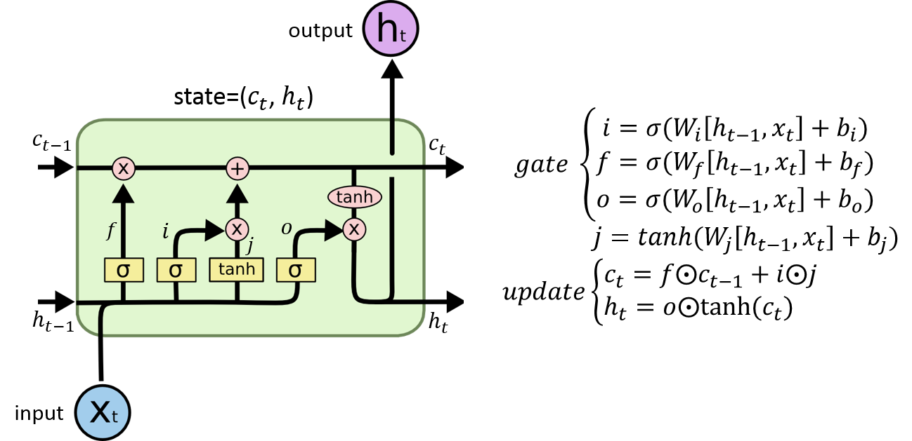

1. TF-IDF公式
    - 衡量某词汇的重要程度
    - 词频（目标词汇在文章出现的次数/文章总词汇数） * 逆文档频率（log(总文档数量/(包含目标词汇的文档数量+1))）

1. 如何区分模型为线性还是非线性模型
    - 在统计意义上，如果一个回归等式是线性的，那么它的相对于参数就必须也是线性的。如果相对于参数是线性，那么即使性对于样本变量的特征是二次方或者多次方，这个回归模型也是线性的。简单判断：看模型的特征因子对应的参数是否超过**1**个，是则是非线性模型。特别的，逻辑回归模型为广义线性模型，因为其分类的边界是一条直线。对比于线性回归是用`wx+b`去拟合数值`y`，对数几率回归则是用`wx+b`去拟合一个几率`ln(y/(1-y))`。
    
2. `KL散度`（相对熵）是严格的距离函数么
    - 不是，其是用来衡量两个分布之间的差异，因为不满足距离的三种性质（对称、正定、三角不等式）之一：对称性（A->B == B->A），因此不是严格的距离函数。距离函数的另外两个特性为：非负（正定）性（A->B > 0)、三角不等式。余弦距离`（1 - 余弦相似度）`也不是严格的距离函数，其不满足三角不等式性质。
    - 可以通过组合`KL散度`得到既能衡量分布差异也具有对称性的`JS散度`。
    
1. CNN的特点
    - 局部连接
    - 参数共享
    - 层次化表达
    
1. 拉普拉斯矩阵的含义
    - 拉普拉斯矩阵反映了当前节点对周围节点产生扰动时所产生的累积增益，直观上也可以理解为某一节点的权值变为其相邻节点权值的期望影响，形象一点就是拉普拉斯矩阵可以刻画局部的平滑度
    
1. 常见网络层的计算复杂度
    - 
3. 循环神经网络LSTM单个单元的结构以及其6个公式
    - 
    
4. GRU结构及其公式
    - 
    
8. torch中参数keepdim的含义
    - 若`keepdim`值为True，则在输出张量中，除了被操作的`dim`维度值降为1，其它维度与输入张量`input`相同。否则，`dim`维度相当于被执行`torch.squeeze()`维度压缩操作，导致此维度消失，最终输出张量会比输入张量少一个维度。
    
1. 宏平均和微平均的区别
    - 宏平均每个类的权重相同，微平均每条数据的权重相同
    - 若微平均很小，检查样本量较多的类别；反之检查样本量较少的类别
	
1. 全连接层的作用是什么
    - todo
    
1. 1x1卷积的作用是什么
    - todo
    
6. 造成线上指标和训练指标差异的原因
    - todo
    
1. 什么是对比学习
    - 对比学习的对象是增强后的数据，即：将原数据进行两次增强，在增强后的数据中挑选任意两条数据，如果这两条数据来自同一条原数据则拉近它们，否则将它们推远。